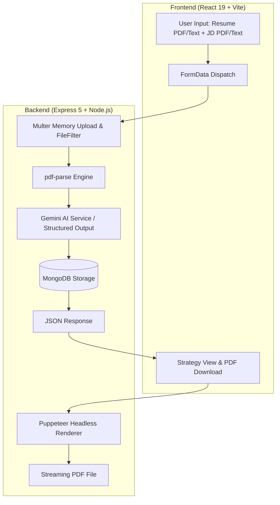

# ⚡ PrepCraft AI

<div align="center">


### *AI-Powered Custom Interview Strategy & Preparation Engine*

Transform job descriptions and resumes into tailored technical questions, behavioral frameworks, match scores, and actionable multi-phase roadmaps.

[](https://nodejs.org/)
[](https://expressjs.com/)
[](https://react.dev/)
[](https://vitejs.dev/)
[](https://www.mongodb.com/)
[](https://ai.google.dev/)
[](LICENSE)

</div>

---

## 🌟 Overview

**PrepCraft AI** is an intelligent full-stack interview preparation suite. By synthesizing candidate resumes and target job descriptions (via either direct text input or PDF uploads), it utilizes Google Gemini AI to produce hyper-personalized interview strategies.

Instead of generic interview practice, PrepCraft AI equips job candidates with:
- **Match Score Gauges** quantifying alignment against the target position.
- **Skill Gap Assessments** highlighting must-address deficiencies categorized by priority (High, Medium, Low).
- **Targeted Technical & Behavioral Questions** complete with sample answers, STAR-framework breakdowns, and assessment criteria.
- **Multi-Phase Preparation Roadmaps** structuring candidate study schedules chronologically.
- **Automated PDF Export** generating printable, offline-ready preparation dossiers via headless Puppeteer.

---

## 🚀 Key Features

- **📄 Flexible Dual-Input Pipeline**
  - **Job Description**: Upload as a PDF document or paste raw text (with live character counter).
  - **Candidate Profile**: Upload resume as a PDF file or enter background/skill notes.
- **🧠 Automated PDF Text Extraction**
  - High-performance, in-memory PDF parsing using `pdf-parse` v2 with file type validation (`application/pdf`) and size caps (5MB).
- **🎯 Precision AI Strategy Synthesis**
  - Powered by Google Gemini (`@google/genai` SDK) configured with strict JSON schemas via `zod-to-json-schema` to eliminate hallucinated response formatting.
- **🗂️ Interactive Strategy Dashboard**
  - Expandable question accordions with question objectives, sample answers, and key evaluation focus areas.
  - Interactive multi-phase timeline roadmap outlining what to study and master day-by-day.
  - Interactive radar of skill gaps tagged by severity.
- **📥 High-Fidelity PDF Dossier Download**
  - One-click server-side PDF generation using headless Puppeteer with styled HTML templates.
- **🗃️ Persistent Strategy History**
  - Revisit past preparation reports anytime from your personal workspace.
  - Delete individual strategies when no longer needed with custom modal confirmation.
- **🛡️ Secure Authentication & Data Privacy**
  - Secure JWT authentication stored in HTTP-only, `sameSite: lax` cookies.
  - Automatic token blacklisting upon logout backed by MongoDB 24-hour TTL indexes.
  - Complete account deletion mechanism with cascading cleanup of all associated interview dossiers and records.
- **🎨 Modern "Electric Aurora" UI**
  - Dark obsidian slate canvas (`#080C14`), frosted glass cards, and Electric Indigo/Cyan glowing accents built with modern SCSS (Dart Sass compliant).

---

## 🏗️ Architecture & Workflow



---

## 💻 Tech Stack

### Frontend
- **Framework**: React 19
- **Build Tool**: Vite 7
- **Routing**: React Router 7
- **HTTP Client**: Axios (with `withCredentials: true`)
- **Styling**: SCSS (Dart Sass modern module system `@use`)
- **State Management**: React Context API (`AuthContext`, `InterviewContext`)

### Backend
- **Runtime**: Node.js 18+
- **Server Framework**: Express 5
- **Database**: MongoDB with Mongoose 9
- **Generative AI SDK**: `@google/genai` (Google Gemini)
- **Schema Validation**: `zod` & `zod-to-json-schema`
- **File Handling**: `multer` (memory storage)
- **Document Processing**: `pdf-parse` v2 & `puppeteer` (headless browser)
- **Security**: `bcryptjs` (password hashing), `jsonwebtoken`, `cookie-parser`

---

## 📁 Repository Structure

```text
GenAI/
├── Backend/
│   ├── src/
│   │   ├── config/             # Database connection setup
│   │   ├── controllers/        # Request handlers (auth, interview)
│   │   ├── middlewares/        # JWT auth verification, Multer PDF filter
│   │   ├── models/             # Mongoose schemas (user, report, blacklist)
│   │   ├── routes/             # REST endpoints (auth, interview)
│   │   └── services/           # Gemini AI prompting & Puppeteer PDF generator
│   ├── .env.example            # Backend environment template
│   ├── package.json            # Backend scripts and dependencies
│   └── server.js               # Express application entrypoint
│
└── Frontend/
    ├── public/                 # Static assets & SVG icons (logo.svg, vite.svg)
    ├── src/
    │   ├── features/
    │   │   ├── auth/           # Login, Register, AuthContext & Auth API
    │   │   └── interview/      # Home, Interview report view, Hooks & Context
    │   ├── style/              # SCSS variables, button styles, global theme
    │   ├── App.jsx             # Route definitions & protected route guards
    │   ├── main.jsx            # React root mount
    │   └── style.scss          # Base reset and Aurora color variables
    ├── index.html              # HTML shell & favicon definition
    ├── package.json            # Frontend scripts and dependencies
    └── vite.config.js          # Vite configuration
```

---

## ⚡ Quick Start Guide

### 1. Prerequisites
Ensure you have the following installed on your machine:
- [Node.js](https://nodejs.org/) (v18.0.0 or higher)
- [MongoDB](https://www.mongodb.com/) (Local community edition or MongoDB Atlas URI)
- [Google Gemini API Key](https://aistudio.google.com/)

---

### 2. Clone the Repository
```bash
git clone https://github.com/your-username/prepcraft-ai.git
cd prepcraft-ai
```

---

### 3. Backend Setup

1. Navigate to the `Backend` directory:
   ```bash
   cd Backend
   ```

2. Install dependencies:
   ```bash
   npm install
   ```

3. Create your `.env` configuration file:
   ```bash
   cp .env.example .env
   ```

4. Populate your `.env` variables:
   ```env
   PORT=3000
   MONGO_URI=mongodb+srv://<user>:<password>@cluster.mongodb.net/prepcraft?retryWrites=true&w=majority
   JWT_SECRET=super_secret_jwt_passphrase_here
   GOOGLE_GENAI_API_KEY=AIzaSy...your_gemini_api_key_here
   ```

5. Start the backend server in development mode:
   ```bash
   npm run dev
   ```
   *The server will start at `http://localhost:3000`.*

---

### 4. Frontend Setup

1. Open a new terminal and navigate to the `Frontend` directory:
   ```bash
   cd Frontend
   ```

2. Install dependencies:
   ```bash
   npm install
   ```

3. Start the Vite development server:
   ```bash
   npm run dev
   ```
   *The client interface will launch at `http://localhost:5173`.*

---

## 🔐 Environment Variables

| Variable | Required | Description | Example |
| :--- | :---: | :--- | :--- |
| `PORT` | Optional | Port for the Express server (defaults to 3000) | `3000` |
| `MONGO_URI` | **Yes** | Connection URI for MongoDB database | `mongodb://localhost:27017/prepcraft` |
| `JWT_SECRET` | **Yes** | Secret cryptographic key for signing auth tokens | `your_secure_random_string` |
| `GOOGLE_GENAI_API_KEY` | **Yes** | Google Gemini Studio API authentication key | `AIzaSy...` |

---

## 📡 API Reference

### Authentication Endpoints (`/api/auth`)

| Method | Endpoint | Description | Auth Required |
| :--- | :--- | :--- | :---: |
| `POST` | `/api/auth/register` | Create a new user account | No |
| `POST` | `/api/auth/login` | Authenticate and issue HTTP-only JWT cookie | No |
| `POST` | `/api/auth/logout` | Invalidate cookie and blacklist active token | **Yes** |
| `GET` | `/api/auth/me` | Retrieve profile of currently authenticated user | **Yes** |
| `DELETE` | `/api/auth/delete-account` | Permanently delete account and all saved plans | **Yes** |

### Interview Endpoints (`/api/interview`)

| Method | Endpoint | Description | Auth Required |
| :--- | :--- | :--- | :---: |
| `POST` | `/api/interview/generate` | Generate interview report from resume & JD | **Yes** |
| `GET` | `/api/interview/all` | Fetch all saved interview strategies for current user | **Yes** |
| `GET` | `/api/interview/report/:interviewId` | Retrieve detailed interview report by ID | **Yes** |
| `GET` | `/api/interview/resume/pdf/:interviewId` | Stream downloadable PDF dossier via Puppeteer | **Yes** |
| `DELETE` | `/api/interview/report/:interviewId` | Delete a specific saved interview strategy | **Yes** |

---

## 🔒 Security & Data Privacy

- **Data Ownership**: Users have full control over their interview data. Deleting an interview strategy permanently purges it from the database.
- **Account Purge**: Deleting an account initiates a cascading purge that deletes the user record, all linked interview strategies, and invalidates all active tokens.
- **Safe Token Blacklist**: Logged-out tokens are placed in an ephemeral blacklist collection with automatic MongoDB TTL expiration to prevent token reuse.
- **Sanitized Extraction**: File uploads are strictly restricted to PDF mime-types with strict size bounds and processed purely in RAM without persistent local storage of raw uploaded files.

---

## 🛠️ Development Scripts

### Backend (`/Backend`)
```bash
npm run dev     # Starts server with nodemon auto-reload
npm test        # Run test suites
```

### Frontend (`/Frontend`)
```bash
npm run dev     # Starts Vite development server with HMR
npm run build   # Compiles production distribution build
npm run lint    # Runs ESLint code quality analysis
npm run preview # Previews compiled production bundle locally
```

---

## 🤝 Contributing

Contributions, issues, and feature requests are welcome!
1. Fork the Project.
2. Create your Feature Branch (`git checkout -b feature/AmazingFeature`).
3. Commit your Changes (`git commit -m 'Add some AmazingFeature'`).
4. Push to the Branch (`git push origin feature/AmazingFeature`).
5. Open a Pull Request.

---

## 📄 License

Distributed under the **MIT License**. See `LICENSE` for more information.

<div align="center">
<sub>Crafted with precision by <strong>Chitresh</strong></sub>
</div>
